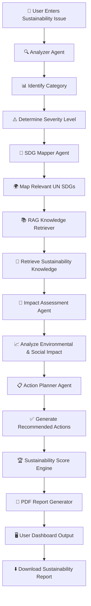

# 🌱 **AI Sustainability Navigator**

### 🚀 **Empowering Communities Through Artificial Intelligence for a Sustainable Future**

---

## 🌍 **Introduction**

**AI Sustainability Navigator** is an intelligent, AI-powered sustainability decision-support platform designed to help communities identify, analyze, and address real-world environmental challenges through innovative Artificial Intelligence solutions.

By integrating **Agentic AI Workflows**, **Sustainable Development Goal (SDG) Mapping**, **Impact Assessment**, **Retrieval-Augmented Generation (RAG)**, and **Action Planning**, the platform transforms complex sustainability issues into meaningful, actionable, and data-driven insights.

Whether addressing **waste management**, **water conservation**, **energy efficiency**, **air quality**, **biodiversity preservation**, or **climate-related risks**, AI Sustainability Navigator empowers users with intelligent recommendations that support environmental responsibility and sustainable community development.

### ✨ **Transforming Sustainability Challenges into Intelligent Solutions**

🔹 Analyze environmental issues using AI

🔹 Map challenges to relevant UN Sustainable Development Goals (SDGs)

🔹 Retrieve sustainability knowledge through RAG

🔹 Assess environmental and social impact

🔹 Generate actionable sustainability recommendations

🔹 Produce comprehensive sustainability reports

---
# 🌍 AI Sustainability Navigator – Project Workflow



## Workflow Explanation

### Step 1: User Input
The user describes a sustainability challenge.

**Example:**
- Plastic waste near a lake
- Air pollution near a school
- Water leakage in a community
- Deforestation near a village

### Step 2: Analyzer Agent
The Analyzer Agent processes the issue and identifies:
- Issue Category
- Severity Level

### Step 3: SDG Mapper Agent
The issue is mapped to relevant United Nations Sustainable Development Goals (SDGs).

### Step 4: RAG Knowledge Retrieval
The system retrieves sustainability knowledge from its local knowledge base.

### Step 5: Impact Assessment
Environmental and social impacts are evaluated.

### Step 6: Action Planning
The Action Planner generates practical recommendations to address the issue.

### Step 7: Sustainability Scoring
A sustainability score is calculated based on issue severity and impact.

### Step 8: Report Generation
A comprehensive sustainability report is generated automatically.

### Step 9: User Output
The dashboard displays:
- Category
- Severity
- SDG Mapping
- Knowledge Insights
- Impact Assessment
- Action Plan
- Sustainability Score

### Step 10: PDF Download
The user can download a complete sustainability report in PDF format.
## 📸 Application Screenshots

### 🏠 Home Dashboard


---

### 🔍 Issue Analysis


---

### 🎯 SDG Mapping


---

### 📚 Knowledge Base Retrieval


---

### 🌍 Impact Assessment


---

### ✅ Action Plan Generation


---

### 📄 Sustainability Report

.png)

---

### 📄 Generated PDF Report

.png)

.png)


🚀 Live Demo

Add this near the top of README:

## 🚀 Live Application

🔗 Try the Live App:

https://0e04d746141abede36.gradio.live


## 📊 Project Presentation

📑 **View the Complete Project Presentation:**

https://canva.link/fyugez7vn0ual19


🎯 Project Objectives
Promote sustainable community development
Support informed environmental decision-making
Increase awareness of UN Sustainable Development Goals
Encourage responsible resource utilization
Demonstrate the practical application of AI for Sustainability
🌍 SDGs Supported
SDG 3 – Good Health and Well-being
SDG 6 – Clean Water and Sanitation
SDG 7 – Affordable and Clean Energy
SDG 11 – Sustainable Cities and Communities (Primary SDG)
SDG 12 – Responsible Consumption and Production
SDG 13 – Climate Action
SDG 15 – Life on Land
🤖 AI Technologies Used
Agentic AI Workflow
IBM SkillsBuild AI Concepts
Prompt Engineering
Sustainability Classification
Retrieval-Augmented Generation (RAG)
Knowledge Retrieval
Impact Assessment Engine
SDG Recommendation System
🌟 Expected Impact

## 📂 Project Structure

```text
AI-Sustainability-Navigator
│
├── app.py
├── requirements.txt
│
├── agents
│   ├── analyzer.py
│   ├── sdg_mapper.py
│   ├── impact_assessor.py
│   └── action_planner.py
│
├── rag
│   └── retriever.py
│
├── reports
│   └── report_generator.py
│
├── data
│   ├── energy_efficiency.txt
│   ├── waste_management.txt
│   └── water_conservation.txt
│
├── assets
│   ├── custom.css
│   ├── hero_banner.png
│   ├── logo.png
│   └── sustainability_bg.png
│
└── Screenshots
    ├── HOME.png
    ├── issue analyzing.png
    ├── SDG Mapping .png
    ├── Knowledge base of the issue .png
    ├── Impact assesment report .png
    ├── Action plan for the issue .png
    ├── Sustainability report pdf doc (1).png
    ├── pdf doc (2).png
    ├── pdf doc (3).png
    ├── PROJECT STRUCTURE 1.png
    └── proj structure 2.png
```

AI Sustainability Navigator empowers citizens, students, organizations, and local communities to make environmentally responsible decisions by providing accessible, AI-driven sustainability insights that contribute to a greener and more sustainable future.
